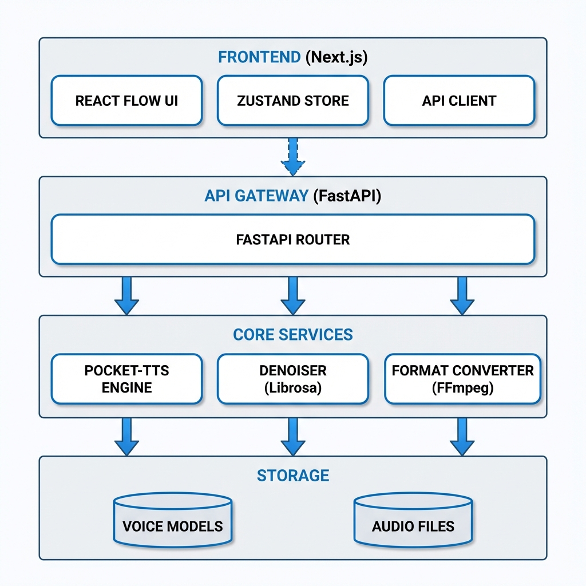
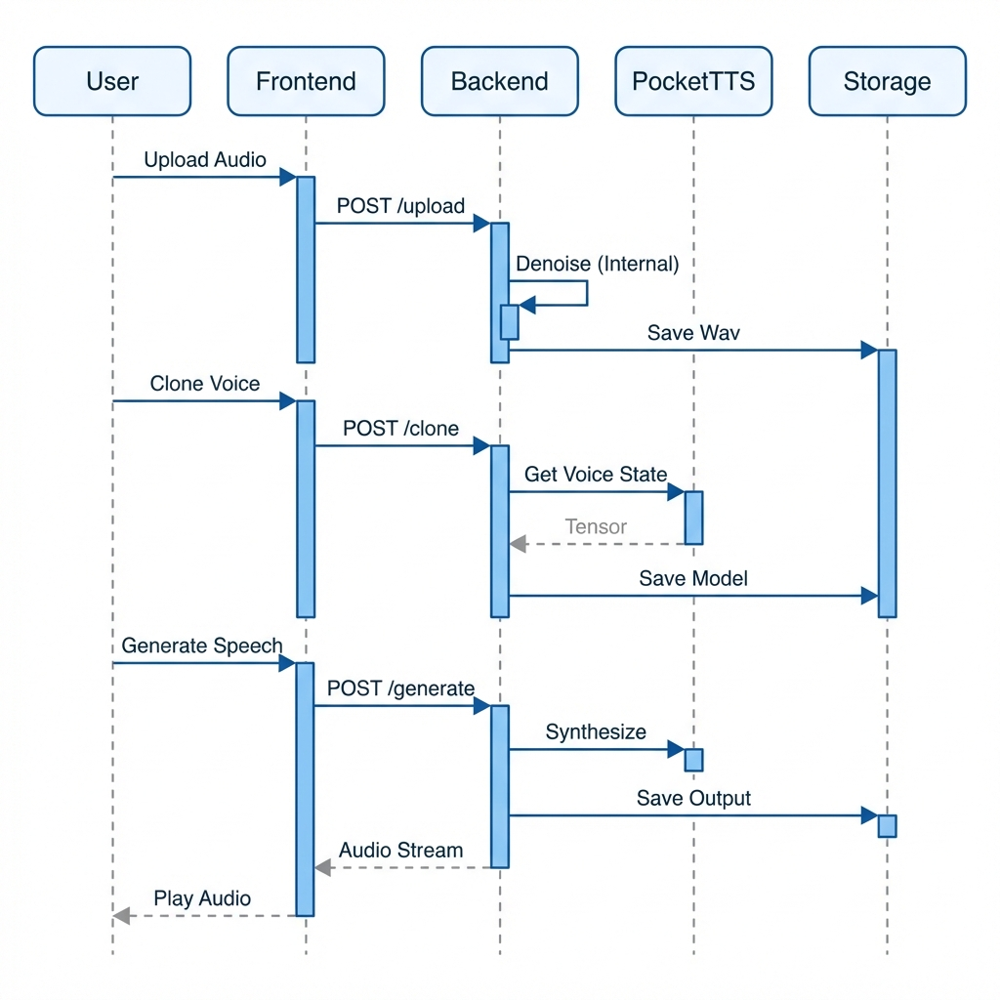

# VoiceForge

A CPU-optimized voice cloning and text-to-speech platform built with Pocket-TTS, FastAPI, and Next.js.

---

## Table of Contents

1. [Overview](#overview)
2. [Architecture](#architecture)
3. [Technology Stack](#technology-stack)
4. [Prerequisites](#prerequisites)
5. [Installation](#installation)
6. [Configuration](#configuration)
7. [Running the Application](#running-the-application)
8. [API Reference](#api-reference)
9. [Project Structure](#project-structure)
10. [Troubleshooting](#troubleshooting)

---

## Overview

VoiceForge enables users to clone voices from audio samples and generate speech using those cloned voices. The platform runs entirely on CPU, making it accessible without GPU hardware.

### Key Features

- Voice cloning from audio samples (minimum 30 seconds)
- Text-to-speech generation with cloned voices
- **🎙️ Podcast Studio** - Create multi-speaker podcasts with screenplay-style scripts
- Speed and pitch adjustment via post-processing
- Automatic audio denoising and format conversion
- Real-time progress streaming via Server-Sent Events
- Support for MP3, WAV, M4A, FLAC, OGG, and WebM formats

---

## Architecture



### Data Flow



---

## Technology Stack

### Frontend

| Component | Technology | Purpose |
|-----------|------------|---------|
| Framework | Next.js 16 | React-based web framework |
| State | Zustand | Lightweight state management |
| Canvas | React Flow | Node-based pipeline editor |
| Styling | Tailwind CSS | Utility-first CSS |
| Animation | Framer Motion | UI animations |
| Audio | WaveSurfer.js | Waveform visualization |

### Backend

| Component | Technology | Purpose |
|-----------|------------|---------|
| Framework | FastAPI | Async Python web framework |
| Server | Uvicorn | ASGI server |
| Voice Engine | Pocket-TTS | CPU-optimized TTS model |
| Audio Processing | librosa | Spectral analysis and effects |
| Format Conversion | pydub + ffmpeg | Multi-format audio support |
| File I/O | soundfile | WAV read/write |

---

## Prerequisites

- Python 3.10 or higher
- Node.js 18 or higher
- HuggingFace account with access to [kyutai/pocket-tts](https://huggingface.co/kyutai/pocket-tts)

---

## Installation

### 1. Clone the Repository

```bash
git clone <repository-url>
cd voiceforge
```

### 2. Backend Setup

```bash
cd backend

# Create virtual environment (recommended)
python -m venv venv
venv\Scripts\activate  # Windows
# source venv/bin/activate  # Linux/macOS

# Install dependencies
pip install -r requirements.txt

# Authenticate with HuggingFace (required for Pocket-TTS)
python -c "from huggingface_hub import login; login(token='YOUR_HF_TOKEN')"
```

### 3. Frontend Setup

```bash
cd frontend

# Install dependencies
npm install
```

---

## Configuration

### Environment Variables

Create `.env.local` in the frontend directory:

```env
NEXT_PUBLIC_API_URL=http://localhost:8000
```

### HuggingFace Authentication

1. Visit [huggingface.co/kyutai/pocket-tts](https://huggingface.co/kyutai/pocket-tts)
2. Accept the model license terms
3. Generate a read token at [huggingface.co/settings/tokens](https://huggingface.co/settings/tokens)
4. Run the authentication script in the backend directory

---

## Running the Application

### Start Backend

```bash
cd backend
python -m uvicorn app.main:app --host 0.0.0.0 --port 8000
```

### Start Frontend

```bash
cd frontend
npm run dev
```

### Access Points

| Service | URL |
|---------|-----|
| Frontend | http://localhost:3000 |
| Backend API | http://localhost:8000 |
| API Documentation | http://localhost:8000/docs |

---

## API Reference

### Audio Endpoints

#### Upload Audio
```
POST /api/audio/upload
Content-Type: multipart/form-data

Response:
{
  "id": "string",
  "filename": "string",
  "duration_seconds": number,
  "sample_rate": number,
  "is_valid": boolean,
  "message": "string"
}
```

#### Get Audio
```
GET /api/audio/{audio_id}
Response: audio/wav file
```

### Voice Endpoints

#### Clone Voice
```
POST /api/voice/clone
Content-Type: application/json

{
  "audio_id": "string",
  "name": "string",
  "tags": ["string"]
}

Response:
{
  "id": "string",
  "name": "string",
  "created_at": "string",
  "duration_seconds": number,
  "tags": ["string"],
  "preview_url": "string"
}
```

#### List Voice Models
```
GET /api/voice/models

Response:
{
  "models": [...],
  "count": number
}
```

### Generation Endpoints

#### Generate Speech
```
POST /api/generate
Content-Type: application/json

{
  "text": "string",
  "voice_model_id": "string",
  "speed": number,      // 0.5 - 2.0
  "pitch": number       // -12 to +12 semitones
}

Response:
{
  "audio_url": "string",
  "duration_seconds": number,
  "sample_rate": number
}
```

#### Generate with Streaming
```
POST /api/generate/stream
Content-Type: application/json

Response: text/event-stream
```

### Podcast Endpoints

#### Generate Podcast
```
POST /api/podcast/generate
Content-Type: application/json

{
  "script": "Speaker 1: Hello!\nSpeaker 2: Hi there!",
  "speaker_map": {
    "Speaker 1": "voice-model-id-1",
    "Speaker 2": "voice-model-id-2"
  },
  "title": "My Podcast"
}

Response:
{
  "id": "string",
  "title": "string",
  "url": "/api/podcast/audio/{id}",
  "duration": number,
  "segments": [...]
}
```

#### Get Podcast Audio
```
GET /api/podcast/audio/{podcast_id}
Response: audio/wav file
```

---

## 🎙️ Podcast Studio

The Podcast Studio allows you to create multi-speaker podcasts by casting your cloned voices to different speakers and writing a screenplay-style script.

### How to Use

1. **Navigate to Podcast Studio**
   - Click "🎙️ Podcast Studio" in the dashboard header
   - Or go to `http://localhost:3000/podcast`

2. **Cast Your Voices**
   - Browse available voice models in the left sidebar
   - Drag and drop voices onto the "Speaker 1" and "Speaker 2" slots on the stage

3. **Write Your Script**
   - Use screenplay format: `SpeakerName: Dialogue text`
   - Example:
     ```
     Speaker 1: Welcome to our podcast!
     Speaker 2: Thanks for having me. This is going to be great.
     Speaker 1: Let's dive right in.
     ```

4. **Generate**
   - Click the green "Generate" button
   - Wait for each segment to be processed (shown in console)
   - Play or download the final stitched audio

### Script Format

```
Speaker 1: First speaker's dialogue goes here.
Speaker 2: Second speaker responds.
Speaker 1: And so on...
```

- Each line must start with the speaker name followed by a colon
- Multi-line dialogue for the same speaker is automatically joined
- Speakers are separated by empty lines (optional)

---

## Project Structure

```
voiceforge/
├── backend/
│   ├── app/
│   │   ├── main.py                 # FastAPI application entry
│   │   ├── models/
│   │   │   └── schemas.py          # Pydantic request/response models
│   │   ├── routers/
│   │   │   ├── audio.py            # Audio upload endpoints
│   │   │   ├── voice.py            # Voice cloning endpoints
│   │   │   └── generation.py       # TTS generation endpoints
│   │   └── services/
│   │       ├── denoiser.py         # Audio processing service
│   │       └── voice_cloner.py     # Pocket-TTS integration
│   ├── uploads/                    # Uploaded audio files
│   ├── voice_models/               # Saved voice states
│   ├── ffmpeg-master-latest-win64-gpl/  # Bundled ffmpeg
│   └── requirements.txt
│
├── frontend/
│   ├── src/
│   │   ├── app/
│   │   │   ├── layout.tsx          # Root layout
│   │   │   └── page.tsx            # Main pipeline page
│   │   ├── components/
│   │   │   ├── nodes/              # React Flow node components
│   │   │   │   ├── VoiceInputNode.tsx
│   │   │   │   ├── VoiceDnaNode.tsx
│   │   │   │   ├── ScriptNode.tsx
│   │   │   │   ├── StyleTuningNode.tsx
│   │   │   │   └── OutputNode.tsx
│   │   │   └── ui/                 # Shared UI components
│   │   │       └── DnaSpinner.tsx
│   │   ├── lib/
│   │   │   ├── api.ts              # API client
│   │   │   ├── confetti.ts         # Success effects
│   │   │   └── utils.ts            # Utility functions
│   │   └── stores/
│   │       └── pipeline.ts         # Zustand state store
│   ├── package.json
│   └── tailwind.config.ts
│
└── README.md
```

---

## Troubleshooting

### Common Issues

#### "Failed to process audio" on MP3 upload

The bundled ffmpeg must be present. Verify:
```bash
dir backend\ffmpeg-master-latest-win64-gpl\bin\ffmpeg.exe
```

If missing, download and extract ffmpeg to the backend directory.

#### "We could not download the weights for the model"

HuggingFace authentication required:
1. Accept terms at [huggingface.co/kyutai/pocket-tts](https://huggingface.co/kyutai/pocket-tts)
2. Run: `python -c "from huggingface_hub import login; login(token='YOUR_TOKEN')"`
3. Restart the backend server

#### Port already in use

Kill existing processes:
```bash
# Windows
netstat -ano | findstr :8000
taskkill /F /PID <pid>

# Or use the included helper script
python backend/kill_port.py
```

#### Audio too short

Voice cloning requires a minimum of 30 seconds of audio. Upload a longer sample.

---

## License

This project uses the Pocket-TTS model from Kyutai Labs, which has its own license terms. Please review and accept the terms at [huggingface.co/kyutai/pocket-tts](https://huggingface.co/kyutai/pocket-tts) before use.
