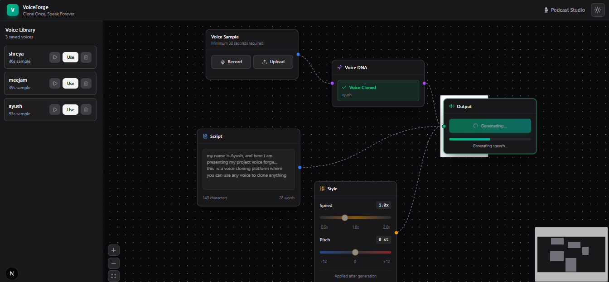
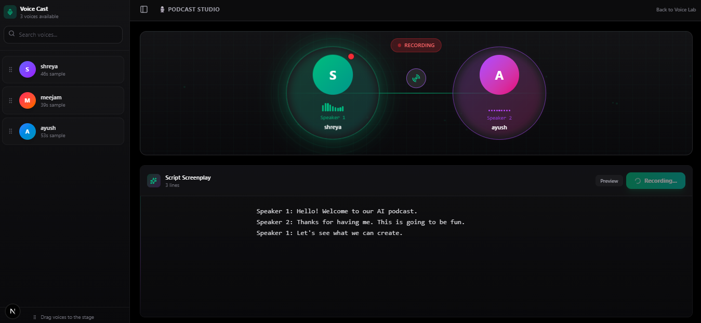

# VoiceForge - CPU-Optimized Voice Cloning and Text-to-Speech Platform

VoiceForge is an enterprise-grade, CPU-optimized voice cloning, text-to-speech (TTS) synthesis, and multi-speaker podcast generation platform. It is engineered using a Next.js frontend, a FastAPI backend, and is powered by Kyutai Labs' Pocket-TTS model. VoiceForge offers a complete studio environment, allowing users to clone custom voices from short audio samples, build node-based audio pipelines, and script multi-speaker podcasts with a virtual studio stage.

---

## System Overview

VoiceForge enables local voice cloning and audio synthesis without requiring specialized GPU hardware. By leveraging the CPU-optimized Pocket-TTS model, it achieves rapid inference times and high-quality voice reproductions. The platform is structured around two distinct operational environments:

1. **The Voice Lab**: A visual, node-based pipeline editor built on React Flow that lets developers and creators design, tune, and test voice cloning and TTS configurations step-by-step.
2. **The Podcast Studio**: A screenplay-based screenplay-writing editor and virtual studio stage that allows creators to script multi-speaker podcasts, cast cloned voices, and generate continuous, stitched high-fidelity podcasts.

### System Screenshots

#### The Voice Lab (Node-Based Pipeline Editor)


#### The Podcast Studio (Multi-Speaker Production)


---

## Key Capabilities

- **Zero-GPU Voice Cloning**: Extract speaker characteristics and register voice models from any audio prompt (minimum 30 seconds of high-fidelity speech) using only CPU resources.
- **Node-Based Audio Pipelines**: Interactively construct audio pipelines by chaining voice inputs, style tuners, screenplay nodes, and post-processing filters.
- **Post-Processing Audio Effects**: Apply high-fidelity, independent speed and pitch adjustments using Librosa spectral analysis, allowing vocal pacing and tone shifting without causing phase distortion or timing errors.
- **Automated Denoising & Normalization**: Preprocess user uploads through an integrated pipeline featuring noise gating, spectral subtraction, and standard WAV formatting to maximize clone fidelity.
- **Real-Time Progress Streaming**: Monitor heavy inference workloads using a Server-Sent Events (SSE) stream, providing live feedback and task updates to the client.
- **Screenplay Script Parsing**: Automatically parse multi-speaker scripts in screenplay format (`Speaker Name: Dialogue text`), distribute tasks to parallel worker threads, and dynamically assemble the final podcast.

---

## Technical Architecture and Data Flow

VoiceForge's architecture decouples core computational heavy lifting from UI interactions through an asynchronous service layer.

### Core Architecture Components

- **FastAPI Backend**: Orchestrates system requests, serves as an endpoint interface, handles file uploads, and acts as the runtime controller for Pocket-TTS and post-processing tasks.
- **Pocket-TTS Engine**: Integrates with Kyutai Labs' model weights (`b6369a24`) to execute voice state registration and neural speech synthesis.
- **Next.js Frontend**: Implements the user interfaces, incorporating React Flow for graph editing, Zustand for state synchronization, and WaveSurfer.js for audio waveform visualization.

### Pipeline Nodes in the Voice Lab

The visual canvas utilizes five custom React Flow nodes to structure speech synthesis:

1. **Voice Input Node**: Receives user-uploaded source audio files or record inputs, serving as the vocal template for cloning.
2. **Voice DNA Node**: Interacts with the backend to trigger state-creation and displays metadata for cloned speaker states.
3. **Script Node**: Houses the text screenplay or dialogue segment to be synthesized.
4. **Style Tuning Node**: Configures generation parameters, including speech velocity (speed) and pitch modulation (semitones).
5. **Output Node**: Connects to the backend generation endpoint, plays the synthesized audio, and renders its spectral waveform.

---

## Detailed Installation and Setup Guide

### 1. Prerequisites

Before installing VoiceForge, ensure the following tools are available on your system:
- **Python**: version 3.10 or higher.
- **Node.js**: version 18 or higher (LTS recommended).
- **FFmpeg**: Required for audio format conversion and post-processing.
  - A bundled version is included in the backend directory. Verify the executable path: `backend/ffmpeg-master-latest-win64-gpl/bin/ffmpeg.exe`.
- **Hugging Face Account**: Required to download and license the Pocket-TTS weights from Kyutai Labs.

### 2. Hugging Face Authentication

1. Navigate to Hugging Face and accept the license terms for [kyutai/pocket-tts](https://huggingface.co/kyutai/pocket-tts).
2. Generate a **Read** permission token at your Hugging Face Settings.
3. Authenticate your local system using:
   ```bash
   python -c "from huggingface_hub import login; login(token='YOUR_HF_TOKEN')"
   ```

### 3. Backend Installation

Navigate to the backend directory, initialize a virtual environment, install requirements, and run the FastAPI server:

```bash
cd backend

# Initialize Python virtual environment
python -m venv venv

# Activate virtual environment
# Windows (PowerShell)
venv\Scripts\Activate.ps1
# Windows (CMD)
venv\Scripts\activate.bat
# Linux/macOS
source venv/bin/activate

# Install required packages
pip install -r requirements.txt

# Launch FastAPI development server via Uvicorn
python -m uvicorn app.main:app --host 0.0.0.0 --port 8000
```

### 4. Frontend Installation

Navigate to the frontend directory, install npm dependencies, and start the Next.js development server:

```bash
cd ../frontend

# Install npm dependencies
npm install

# Run the development server
npm run dev
```

### 5. Website Installation (Optional Documentation / Landing Page)

Navigate to the website directory, install dependencies, and launch:

```bash
cd ../website

# Install npm dependencies
npm install

# Run website server
npm run dev
```

---

## System Configuration and Environment Variables

### Frontend Environment Configuration

Create or modify `.env.local` inside the `frontend` directory:

```env
NEXT_PUBLIC_API_URL=http://localhost:8000
```

### Website Environment Configuration

Create or modify `.env.local` inside the `website` directory to hook up to documentation resources or landing pages.

---

## API Reference

### Audio Upload and Processing

#### Upload Audio File
* **Endpoint**: `POST /api/audio/upload`
* **Content-Type**: `multipart/form-data`
* **Request Payload**:
  * `file`: Binary audio file (MP3, WAV, M4A, FLAC, OGG, or WebM).
* **Success Response (200 OK)**:
  ```json
  {
    "id": "a9b8c7d6-e5f4-3c2b-1a09-8f7e6d5c4b3a",
    "filename": "vocal_sample.wav",
    "duration_seconds": 32.45,
    "sample_rate": 24000,
    "is_valid": true,
    "message": "Audio file uploaded and verified successfully"
  }
  ```

#### Fetch Audio Source
* **Endpoint**: `GET /api/audio/{audio_id}`
* **Success Response (200 OK)**: Binary audio stream (audio/wav).

---

### Voice Cloning and Management

#### Clone Voice DNA
* **Endpoint**: `POST /api/voice/clone`
* **Content-Type**: `application/json`
* **Request Payload**:
  ```json
  {
    "audio_id": "a9b8c7d6-e5f4-3c2b-1a09-8f7e6d5c4b3a",
    "name": "Host Voice",
    "tags": ["professional", "male", "warm"]
  }
  ```
* **Success Response (200 OK)**:
  ```json
  {
    "id": "v7w6x5y4-z3u2-t1s0-r9q8-p7o6n5m4l3k2",
    "name": "Host Voice",
    "created_at": "2026-05-19T10:15:00.123456",
    "duration_seconds": 32.45,
    "tags": ["professional", "male", "warm"],
    "preview_url": "/api/voice/models/v7w6x5y4-z3u2-t1s0-r9q8-p7o6n5m4l3k2/preview"
  }
  ```

#### List Cloned Models
* **Endpoint**: `GET /api/voice/models`
* **Success Response (200 OK)**:
  ```json
  {
    "models": [
      {
        "id": "v7w6x5y4-z3u2-t1s0-r9q8-p7o6n5m4l3k2",
        "name": "Host Voice",
        "created_at": "2026-05-19T10:15:00.123456",
        "duration_seconds": 32.45,
        "tags": ["professional", "male", "warm"]
      }
    ],
    "count": 1
  }
  ```

---

### Speech Synthesis and Effects

#### Generate Speech
* **Endpoint**: `POST /api/generate`
* **Content-Type**: `application/json`
* **Request Payload**:
  ```json
  {
    "text": "Welcome to VoiceForge, where voice cloning is made accessible entirely on consumer CPU systems.",
    "voice_model_id": "v7w6x5y4-z3u2-t1s0-r9q8-p7o6n5m4l3k2",
    "speed": 1.1,
    "pitch": 2.0
  }
  ```
* **Success Response (200 OK)**:
  ```json
  {
    "output_id": "b1c2d3e4-f5a6-7b8c-9d0e-1f2a3b4c5d6e",
    "audio_url": "/api/audio/outputs/b1c2d3e4-f5a6-7b8c-9d0e-1f2a3b4c5d6e.wav",
    "duration_seconds": 4.82,
    "sample_rate": 24000
  }
  ```

#### Stream Generation Status
* **Endpoint**: `POST /api/generate/stream`
* **Content-Type**: `application/json`
* **Response Protocol**: Server-Sent Events (text/event-stream) emitting real-time stage progress percentages and generation completion status.

---

### Podcast Studio Production

#### Generate Podcast Screenplay
* **Endpoint**: `POST /api/podcast/generate`
* **Content-Type**: `application/json`
* **Request Payload**:
  ```json
  {
    "script": "Host: Welcome back to VoiceForge Radio.\nGuest: Thanks for having me, Ayush.",
    "speaker_map": {
      "Host": "v7w6x5y4-z3u2-t1s0-r9q8-p7o6n5m4l3k2",
      "Guest": "x9y8z7w6-v5u4-t3s2-r1q0-p9o8n7m6l5k4"
    },
    "title": "VoiceForge Overview Podcast"
  }
  ```
* **Success Response (200 OK)**:
  ```json
  {
    "id": "p1o2d3c4-a5s6-7d8f-9g0h-1j2k3l4m5n6o",
    "title": "VoiceForge Overview Podcast",
    "url": "/api/podcast/audio/p1o2d3c4-a5s6-7d8f-9g0h-1j2k3l4m5n6o",
    "duration": 18.75,
    "segments": [
      {
        "speaker": "Host",
        "text": "Welcome back to VoiceForge Radio.",
        "duration_seconds": 8.45
      },
      {
        "speaker": "Guest",
        "text": "Thanks for having me, Ayush.",
        "duration_seconds": 10.30
      }
    ]
  }
  ```

#### Fetch Stitched Podcast Audio
* **Endpoint**: `GET /api/podcast/audio/{podcast_id}`
* **Success Response (200 OK)**: Binary audio stream (audio/wav) containing the complete multi-speaker stitched dialogue.

---

## Detailed Troubleshooting

### 1. MP3 Processing and FFmpeg Errors
* **Symptom**: System reports "Failed to process audio" or encounters library load failures when uploading non-WAV formats.
* **Cause**: The system depends on FFmpeg to convert MP3, M4A, FLAC, and WebM formats to standard WAV before cloning. If the bundled FFmpeg is missing or blocked, the pydub backend fails.
* **Resolution**:
  - Verify that `backend/ffmpeg-master-latest-win64-gpl/bin/ffmpeg.exe` exists and has standard read/execute privileges.
  - Alternatively, ensure FFmpeg is added to your operating system's PATH variable.

### 2. Hugging Face Access Denied or Weight Download Failures
* **Symptom**: Console throws an error stating "We could not download the weights for the model b6369a24."
* **Cause**: Pocket-TTS is a restricted-weight model. You must accept Kyutai Labs' terms of service on their model repository page prior to local initialization.
* **Resolution**:
  - Visit [kyutai/pocket-tts](https://huggingface.co/kyutai/pocket-tts) in your browser and log in with your Hugging Face credentials.
  - Formally accept the licensing agreement.
  - Run the `backend/hf_login.py` script or execute `huggingface-cli login` in your terminal to cache your authentication state.

### 3. Port Already in Use (Address Conflict)
* **Symptom**: Backend FastAPI server fails to start with standard "Address already in use" errors.
* **Cause**: A background uvicorn or next.js process from a previous workspace run is still occupying ports 8000 or 3000.
* **Resolution**:
  - Run the included python script to clean existing ports:
    ```bash
    python backend/kill_port.py
    ```
  - Alternatively, identify and kill the processes manually on Windows:
    ```powershell
    netstat -ano | findstr :8000
    taskkill /F /PID <PID_FOUND>
    ```

### 4. Low Fidelity Clones or Vocal Distortion
* **Symptom**: The cloned voice sounds robotic, has a lot of static, or displays excessive background resonance.
* **Cause**: The original audio prompt has high noise floor, background music, or the speaker is too close to the microphone.
* **Resolution**:
  - Upload an audio file with at least 30 seconds of clean, continuous speech.
  - Ensure the source audio sample rate is high (minimum 16kHz, recommended 24kHz or 48kHz).
  - Let the integrated VoiceForge denoiser filter the input. Avoid pre-processing with severe filters that destroy vocal frequencies.

---

## License

This software integrates Kyutai Labs' Pocket-TTS voice generation framework. Use of this application requires adherence to the respective model license agreements and the Hugging Face Terms of Service. Check the [Kyutai Pocket-TTS License](https://huggingface.co/kyutai/pocket-tts) for legal limitations on synthesized voice distribution.
